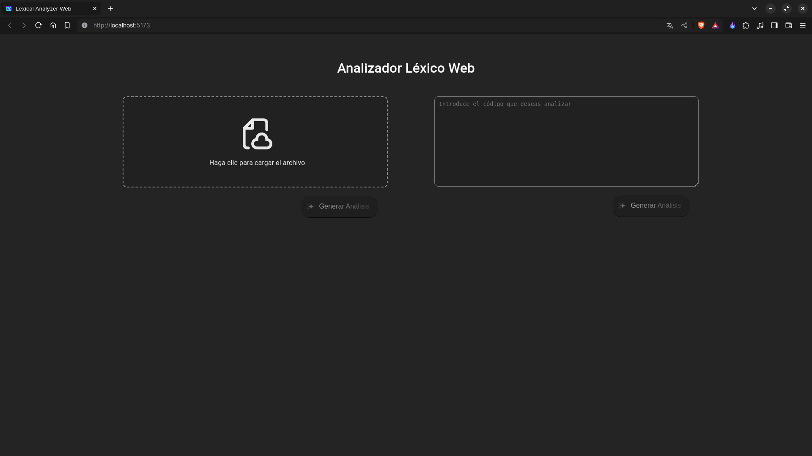

# Analizador léxico web

## Instrucciones de clonación del repositorio

```bash
git clone https://github.com/NoeOnDev/Lexical-Analyzer-Web.git
```

## Configuración e instalación de las dependencias de la API back-end

1. Asegúrese de tener Python 3.8 o superior instalado en su sistema. Puede verificar su versión de Python con el siguiente comando:

    ```bash
    python --version
    ```

2. Instale las dependencias de Python necesarias con pip:

    ```bash
    pip install flask flask_cors python-dotenv ply
    ```

3. Entre a la carpeta donde se encuentra la API back-end:

    ```bash
    cd Lexical-Analyzer-Web/Api-back-end/
    ```

4. Debe crear un archivo .env para almacenar las variables de entorno que necesita la API back-end para funcionar;

    ```bash
    touch .env
    ```

5. Dentro del proyecto de la API back-end encontrará un archivo .example.env que contiene las variables de entorno necesarias para que la API back-end funcione, copie y pegue esas variables en el archivo .env creado anteriormente, Por ejemplo:

    ```bash
    PORT = 3003
    HOST = localhost
    ORIGINS = http://localhost:5173
    ```

6. Una vez completando los pasos anteriores, ahora puede probar iniciando el archivo server.py de la siguiente manera:

    ```bash
    python3 server.py
    ```

7. Si ha completado todos los pasos correctamente, en su terminal o consola debería mostrar un mensaje igual al siguiente:

    ```bash
    * Serving Flask app 'server'
    * Debug mode: on
    WARNING: This is a development server. Do not use it in a production deployment. Use a production WSGI server instead.
    * Running on http://localhost:3003
    Press CTRL+C to quit
    * Restarting with stat
    * Debugger is active!
    ```

## Configuración e instalación de las dependencias del front-end

1. Asegúrese de tener Node.js y npm instalados en su sistema. Puede verificar sus versiones con los siguientes comandos:

    ```bash
    node --version
    npm --version
    ```

2. Entre a la carpeta donde se encuentra el front-end:

    ```bash
    cd Lexical-Analyzer-Web/front-end/
    ```

3. Instale las dependencias de Node.js necesarias con npm:

    ```bash
    npm install
    ```

4. Ahora puede iniciar el proyecto front-end con el siguiente comando:

    ```bash
    npm run dev
    ```

5. Si cuenta con una versión igual o superior a las v22.0.0 de node, le recomiendo usar el siguiente comando:

    ```bash
    node --run dev
    ```

## Funcionalidad

El analizador léxico toma un archivo de entrada o un código fuente y lo analiza para identificar los tokens definidos.

1. Página de inicio

    

2. Video de la funcionalidad

    [](http://www.youtube.com/watch?v=9PIXphm_UYs "Video de la funcionalidad")
